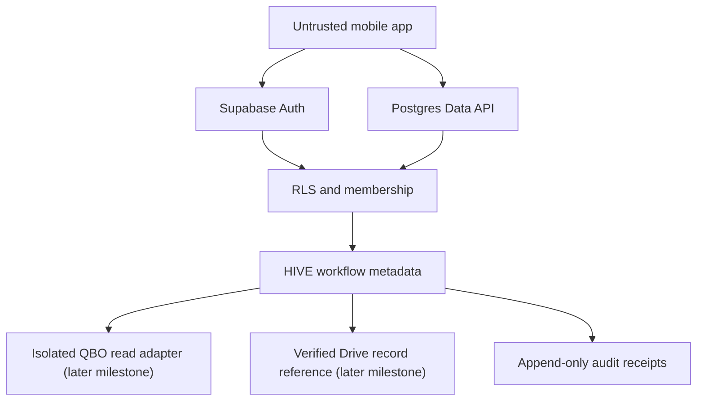

# Architecture — HIVE mobile foundation

## Topology

Work Order 001 ends at Auth, RLS, HIVE metadata, and local audit evidence.
No QBO, Drive, Twenty, or Slack connection exists in this codebase; the
adapters below appear only to fix the later boundary contract.

| Boundary | Authority | Mobile capability | Forbidden |
|---|---|---|---|
| Supabase Auth | Identity and session | OTP, MFA, current-user verification | Membership or accounting authority |
| Postgres and RLS | Client/entity authorization and HIVE metadata | Exact scoped reads and approved narrow calls | Service key, arbitrary scope, direct approval mutation |
| HIVE transition service | Workflow/review/approval state | Request a permitted transition | Client-controlled state assignment |
| Google Drive | Permanent retained record | View verified reference when authorized | Mobile filing, delete, move, share, permission change |
| QBO adapter | Read-only ledger context | Bounded source reference | Any token, POST, PATCH, PUT, DELETE, reconciliation, journal action |
| Twenty | Relationship status | No Milestone 0 access | Become HIVE workflow authority |
| Slack | Internal coordination | No client-record authority | Permanent record or approval source |

## Module ownership

| Path | Owns | May depend on |
|---|---|---|
| `app/` | Thin Expo Router routes: navigation and state→screen mapping only | `src/*` |
| `src/core/` | Environment validation, clock, opaque IDs, safe error mapping, diagnostics interface, SHA-256 | nothing app-internal |
| `src/ui/` | Semantic tokens, contrast math, accessible primitives | `src/core` |
| `src/auth/` | Auth reducer/state machine, lifecycle controller, SecureStore adapter, install marker, epoch, views | `src/core`, `src/ui`, `src/data/supabase` (client factory only) |
| `src/tenancy/` | Membership types, ScopeKey, scope chooser, clearing rules | `src/core`, `src/ui` |
| `src/data/supabase/` | The one client factory, generated database types, typed scoped repositories | `src/core`, `src/tenancy` (types) |
| `src/features/dashboard/` | The scoped empty dashboard and synthetic cards | everything above |
| `supabase/` | Migrations, grants, RLS, pgTAP tests, config | — |
| `scripts/` | Toolchain, local-Supabase, secret-scan, type-drift, config, bundle-inspection commands | node stdlib only |

Dependency direction is strictly downward in that table; `src/core` imports
nothing app-internal, and only `src/data/supabase/client.ts` constructs a
Supabase client.

## Data flow (Milestone 0)

1. Boot: env validation → install-marker reconciliation → secure-store read
   (digest-verified) → single Supabase client construction → session check →
   membership query → scope selection → dashboard.
2. All reads: repository bound to an immutable ScopeKey → PostgREST with the
   user JWT → RLS membership filter → rows already scoped; the repository
   also filters by the same scope as defense in depth.
3. Writes: none from the client in Milestone 0 (dashboard is read-only; the
   only mutations are auth-lifecycle local effects). The protected-mutation
   contract (idempotency key, object version, exact scope, server time,
   atomic audit receipt) binds every later milestone.

## Dependency policy

For every proposed dependency record: required user outcome; why React
Native, Expo, JavaScript, CSS-equivalent styling, Postgres, or an installed
dependency cannot do it; exact version and official source; native
permissions and store disclosures it adds; maintenance and security
posture; bundle impact; removal/rollback plan. Reject dependencies that do
not clear the review. Decisions live in `docs/decisions/`.

Milestone 0 explicitly excludes state/styling/UI frameworks, Realtime,
notifications, analytics, OCR, response caching, certificate pinning, and
EAS Update.

## Environment separation

Each environment (development / later staging / later production) is a
separate Supabase project with separate credentials; nothing crosses
environments. `environment_id` on every row is defense in depth. The local
development stack runs on loopback via the pinned Supabase CLI
(`scripts/local-supabase.mjs`); its keys never appear in source, and the
release configuration check rejects loopback URLs, legacy anon keys, and
development identifiers.

## Rollback boundary

- App: git history; each checkpoint is a coherent commit that passes its
  gates, so rollback is a checkout of the prior checkpoint.
- Database: `supabase db reset --local` rebuilds from committed migrations;
  migrations stay additive and reversible during Milestone 0 (no destructive
  migration may land unresolved).
- No OTA lane exists, so no remote code state needs rolling back; store
  binaries (much later) roll back by store release, with kill switches that
  preserve source records and audit history.
